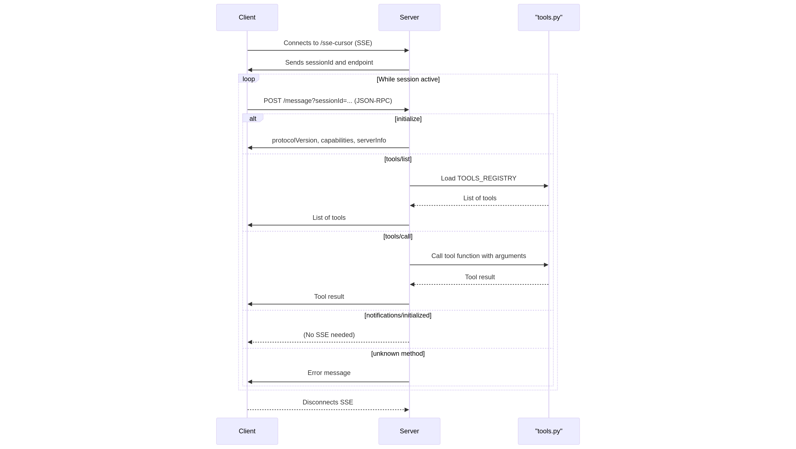

# A Simple Framework for Creating an MCP Server

**Note:** Tested only with Cursor.

This project was created after encountering several issues with **sse transport protocol** [modelcontextprotocol/python-sdk](https://github.com/modelcontextprotocol/python-sdk). The basic setup was inspired by [b3nelof0n/node-mcp-server](https://github.com/b3nelof0n/node-mcp-server/blob/main/server.js).

